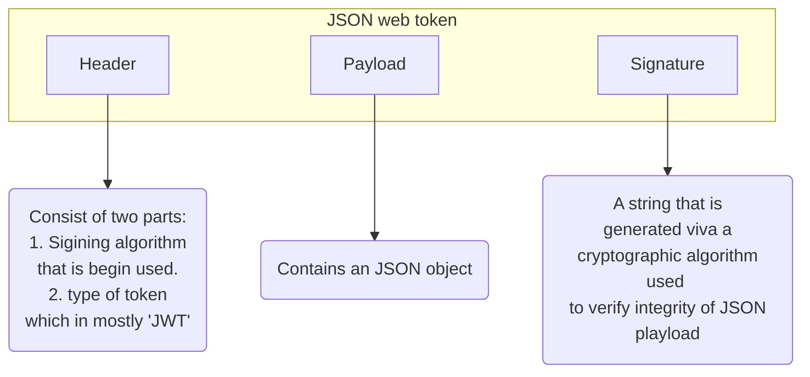

# JWT | JSON web token

Used to securely transfer information over the web.It can be used for an authenentication system and can also be used for information exchange between client and a server.

**Token mainly composed of**
- Header
- Payload
- Signature

**Structure of JSON**

Defines the structure of information we are sending from one party to another, and it comes in two forms:

**Serialized**

This involves transfer of data through the network with request and response.

**Deserialized**

Used to read and write data to the web token.In deserialized form contains only the header and the playoad. Both of them are plain JSON objects.